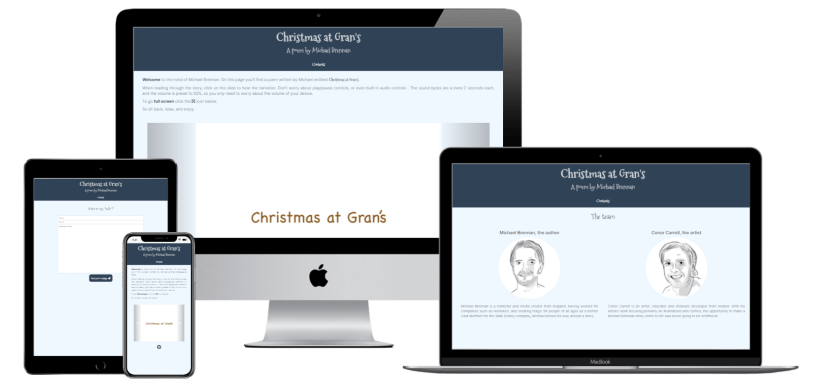
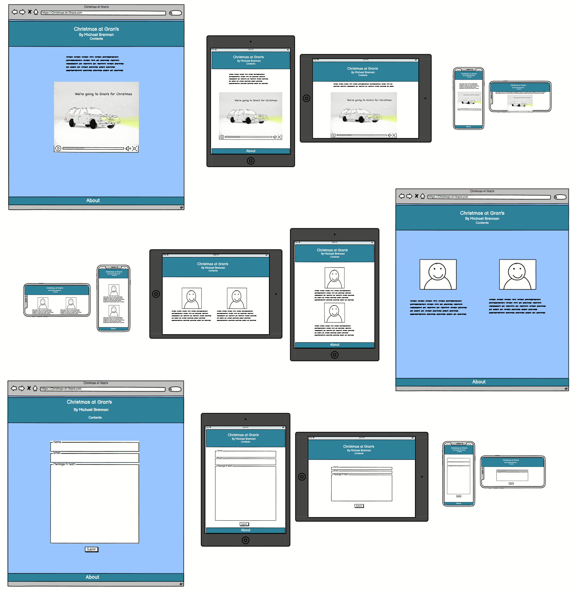
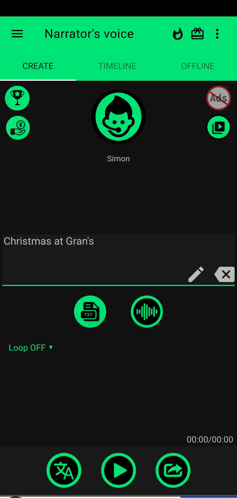
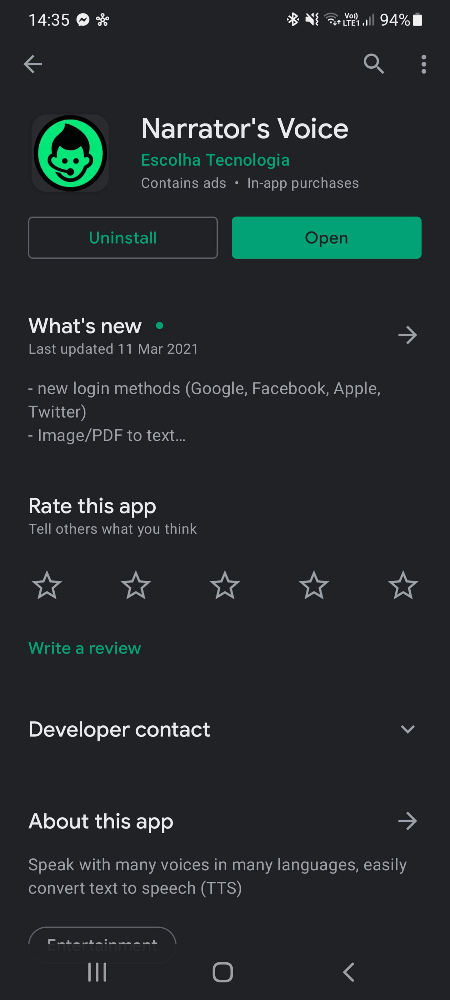
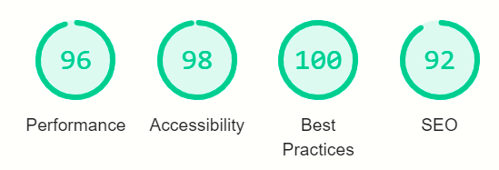
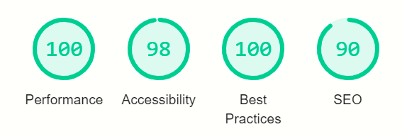
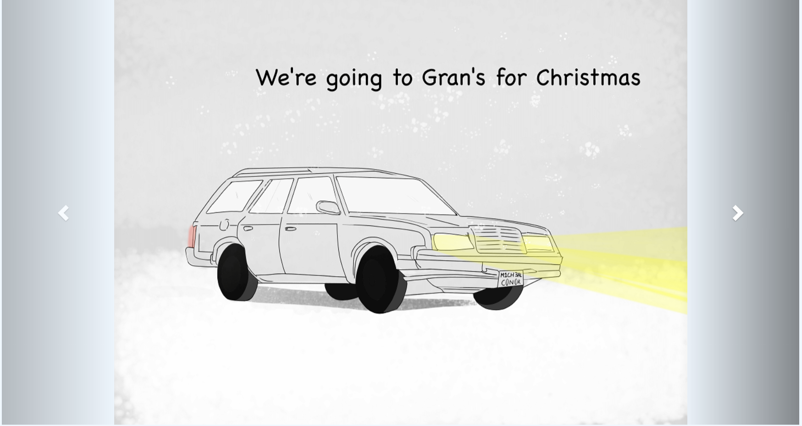
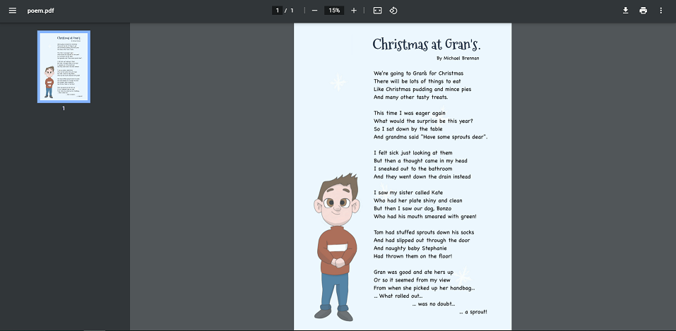
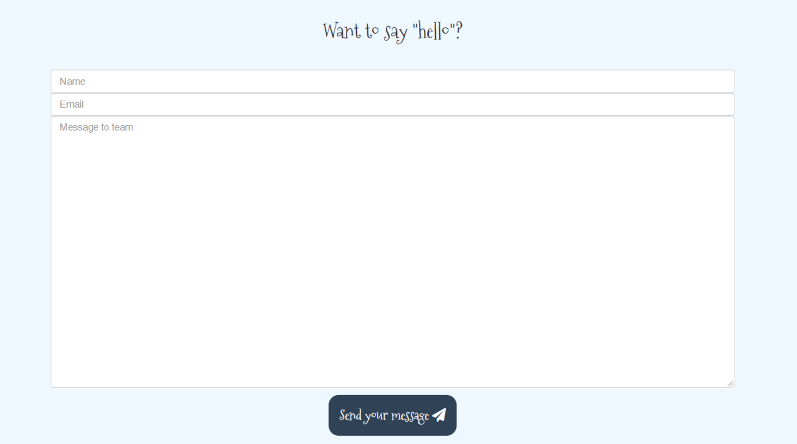

# Christmas at Gran's

"Christmas at Gran's" is a poem written by Michael Brennan at the age of ten. Due to the Covid-19 pandemic, 
Brennan was forced to return to England from his home of many years, Dublin. It is here that the Author of this 
site, Conor Carroll, resides. Carroll, on the side, is an artist and illustrator, and decided to create this site 
as a homage to his friend. 

The pair are aligned in the belief that there can never too many stories in the world, and so pushing this poem 
to the greater reaches of the internet is not just a present for a friend, but a light-hearted form of digital story 
telling. The resulting piece is aimed to be age appropriate, approachable, and enjoyable, while being completely accessible 
to all audiences.

---

## Table of contents

1. [**UX**](#ux)
    - [**Scope**](#scope)
    - [**Structure**](#structure)
    - [**Skeleton**](#skeleton)
    - [**Surface**](#surface)
    
2. [**Features**](#features)
    - [**Existing features**](#existing-features)
    - [**Features left to implement**](#features-left-to-implement)

3. [**Technologies Used**](#technologies-used)

4. [**Testing**](#testing)

5. [**Deployment**](#deployment)

6. [**Credits**](#credits)
    - [**Content**](#content)
    - [**Resources**](#resources)
    - [**Media**](#media)
    - [**Acknowledgements**](#acknowledgements)

---

## UX

### Scope

The site is made to be an online story aimed at children. The site is made to host an image carousel with optional audio.

#### User stories

##### Visitor goals

1. As a visitor to the site, I want to read a poem about a traditional family Christmas.
2. As a visitor to the site, I want full accessibility and array of methods to enjoy the story.
3. As a visitor to the site, I want to be able to contact the creators of the story and the site for a variety of reasons.

##### Owner goals

4. As the owner of the site, I want to tell a fun story on behalf of a close friend - the world can never have too many stories.
5. As the owner of the site, I want to promote my work, both in visual storytelling and in site development.

### Structure

The site has been put together using HTML, CSS, and Javascript.
Supports, such as Bootstrap and jQuery, were installed, and used where necessary, or for future developments of the project. 
Navigation through the site can be easily done using the nar-bar button in the header, but an additonal "about" feature located in the footer.

### Skeleton

Section 1 - Home page - Header with title and navigation on top, an introduction to the story and how to use the features, 
a carousel of images to tell the story, a brief team section, and a footer loate at the bottom to frame the page, with a brief "about" section.

Section 2 - Contact page - With the same header and footer, the page is filled with a contact form, requiring the user input their name, email and 
message to the team, before clicking on a styled "submit" button.

**Wireframe**

The initial wireframe

### Surface

**Colours**

The colours used were intentional, to reflect the snowy, cold conditions that many associate with the holiday season. A light blue for the background and 
a darker blue for the header and footer create a contrast that remains soft to look at, while generating feelings of winter. 

Colours used on the site are (without titles):

- #304255 : A greyish dark blue used for the header and footer, as well as on the buttons.

- #f0f8ff : A lighter blue used for the background colour of the site. It's lightness creates a suitable contrast for black font to appear.

- #d4d7da : An off-white/blue that is used for the header/footer/button fonts. It creates a softness while still being legible.

- #253241 : A darker for mof the header, used as a hover for the dropdown menu and the intro font.

**Icons** used are from fontawesome.com. They are seen on the fullscreen button and the submit button.

**Images** used are all drawn by the author of the site, Conor Carroll. They are in png format, and have been condensed. 

**Audio** used comes from a text-to-speech app "Narrator's Voice", available [here](https://play.google.com/store/apps/details?id=br.com.escolhatecnologia.vozdonarrador&hl=en&gl=US) on the Google Play Store.  

**Fonts** :

- **Mountains of Christmas" was used for the header, footer, subheading and buttons, as well as mentions of the title "Christmas at Gran's".
- **Inter** was used for all other areas

##### back to [contents](#table-of-contents)

---

## Features

The site is built up of two pages

### Existing Features

- Dropdown navbar button "Contents"
- Image carousel, built using Bootstrap
- Audio on slides, activated by click
- Aditional "About" button, showing another paragraph
- A contact form with email functionality
- Screen-reader spans on every image slide
- Captions on unfinished artwork

### Features to Implement

- Finished artwork to remove the need for Captions
- A whack-a-mole style game that feeds sprouts to Bonzo to add a fun element to the page,
as the project is aimed at children

 ##### back to [contents](#table-of-contents)

 ---

## Technologies Used

- Languages : HTML, CSS, Bootstrap, Javascript.

- IDE: [Gitpod](https://www.gitpod.io/)

- Version control: Git on [Gitpod](https://www.gitpod.io/) and [Github](https://github.com/).

- Wireframe: [Balsamiq](https://balsamiq.com/)

- Browser developer tools: Google Chrome

- Fonts : [Google Fonts](https://fonts.google.com/)

- Icons : [Fontawesome](https://fontawesome.com/)

- Images : Autodesk Skecthbook Pro and Apple iPad Pro

- Image editing : [tinypng](https://tinypng.com/) compression tool.

- Colour tool : https://material.io/resources/color

##### back to [contents](#table-of-contents)  

---
## Testing

Testing was carried out throughout the build process of the site.

### Lighthouse - Google Chrome Developer Tools

- [lighthouse](https://developers.google.com/web/tools/lighthouse) report in Chrome devtools and on command line.

The initial tests resulted in quite a poor performance score due to the amount of information presented on 
the Index page. The 'Team' section required additional loading, images, and increased the page length.

It was due to this score that the Team page was created, in order to improve the overall performance of the site 
and prevent frustration from users.

### Bugs encountered

1. The About button failed to fire when another button existed on the page. It is unclear to me why 
the Javascript could not activate the button based on the id, as in my code, but the result was changing the 
button to clickable div element.
To fix this issue, the About div was removed, and the footer replaced witha more contemporary footer.
The information was then moved to the Team page, and attached to a Secret button to act as a message from the team.

2. The requestFullscreen function would not launch while the button to signal the command was inside the carousel div.
This was a simple fix, but it does compromise the look of the page.

3. Image scaling was an issue. The images were created in a 4:3 ratio, and my initial CSS stretched the images accorss the 
screen. When in fullscreen, the images would stretch appear beyond the border of the page, making it imposible to see.

4. Audio controls: I wanted the audio to be a simple "click next slide, hear the audio". However, due to Chrome and most modern browsers 
blocking any autoplay feature, this was not working. The code required would have been exhaustive. I instead opted 
for a much safer, user friendly approach of a preset volume of 50%, and a click-to-play feature on the images. This 
removed the need for controls, as the audio bytes are minimal in length, and ensured that a user with sensory 
issues would not be bombarded with loud or unexpected audio.

### Known issues

1. When in fullscreen, the images do not take up the entirety of the screen, and sit at the top of the page, with a black surround.
On odd shaped screens the images do not appear correctly.
2. The quiz aligns to the left and fails to react to attempts to stylise.

### Version control

In truth, this site was rebuild. My initial site build was muddled with broken code, and destroyed. While testing features 
that wouldn't launch, I used a separate repository, although I am now aware that I should have been branching the site 
and merging on Github. This is a lesson learned. The test repository can be found [here](https://github.com/ccarroll91/game-test).

### Functionality testing

- Navbar: Links between the three pages work successfully

- Fullscreen: The fullscreen button works, although outside of the div

- Carousel: The carousel works, with functional glyphs, as expected from the Bootstrap plugin

- Audio: The audio works on each slide

- About: The about section requires the user to click on the lower half of the div, before changing size 
on a second click.

- Email: The emailjs function has been tested and works adequetely, although the message and user data remains in the box when submitted

## User stories

1. As a visitor to the site, I want to read a poem about a traditional family Christmas.

*The user can read the story with ease*

2. As a visitor to the site, I want full accessibility and array of methods to enjoy the story.

*The user has both audio and visual methods of enjoying the story, and has the option of screen reader compatibility and a downloadable version as seen above*

3. As a visitor to the site, I want to be able to contact the creators of the story and the site for a variety of reasons.

*There is a functional contact page on the site to do so*

##### Owner goals

4. As the owner of the site, I want to tell a fun story on behalf of a close friend - the world can never have too many stories.

*I have told the story, although the artwork was not finished at the time of the launch*

5. As the owner of the site, I want to promote my work, both in visual storytelling and in site development.

*Some of my visual work was displayed nicely, but the art is not finished. The site functions 
to a satisfactory level*

##### back to [contents](#table-of-contents)

---
## Deployment

The site was deployed on Github with the use of a use of a Github account, and built 
usig Gitpod.
 For instructions on how to:
 1. Clone:
 - On GitHub, navigate to the main page of the repository.
 - Above the list of files, click  the "down-arrow" and Code button, in green.
 - To clone the repository using HTTPS, under "Clone with HTTPS", click the clipboard icon. 
 To clone a repository using GitHub CLI, click Use GitHub CLI, then click the clipboard icon.
 - Open Git Bash.
 - Change the current working directory to the location where you want the cloned directory.
 - Type git clone, and then paste the URL you copied earlier.
 - $ git clone https://github.com/YOUR-USERNAME/YOUR-REPOSITORY
 - Press Enter to create your local clone.

$ git clone https://github.com/YOUR-USERNAME/YOUR-REPOSITORY
> Cloning into `Spoon-Knife`...
> remote: Counting objects: 10, done.
> remote: Compressing objects: 100% (8/8), done.
> remove: Total 10 (delta 1), reused 10 (delta 1)
> Unpacking objects: 100% (10/10), done.

 2. Fork:
 - On GitHub, navigate to the Christmas at Gran's repository.
 - In the top-right corner of the page, click Fork.
 ##### back to [contents](#table-of-contents)  

---
## Credits

### Content

The poem was written by Michael Brennan at the age of ten. All other content on the 
site came at the hands of Conor Carroll.

### Resources

- [Bootstrap components](https://getbootstrap.com/)
- [W3schools](https://www.w3schools.com/)
- [Code institute's Slack workspace channels](https://slack.com)

### Media 

- Images were drawn by Conor Carroll, the author of this site
- Audio came from micro snipets using the app "#"

 ##### back to [contents](#table-of-contents)  